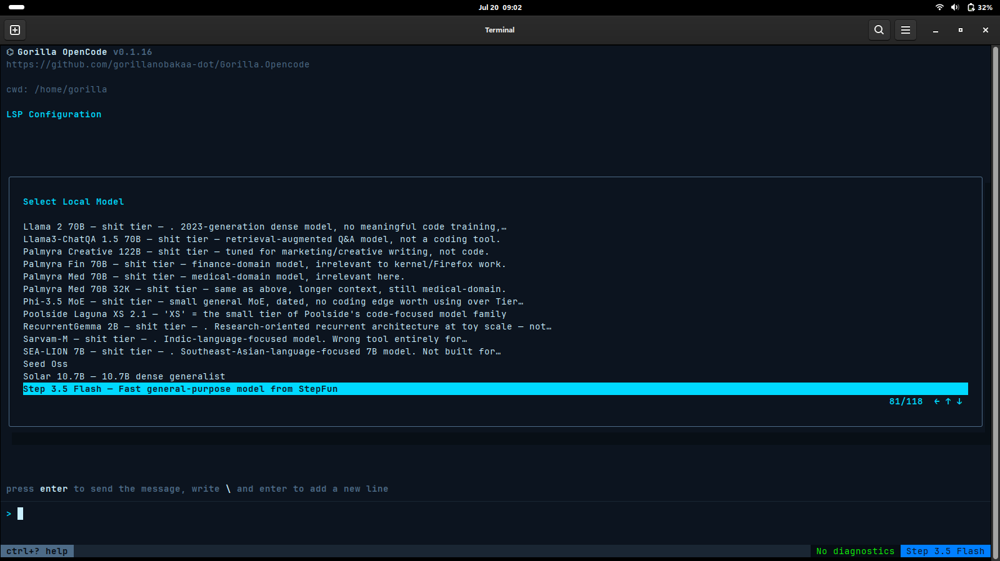
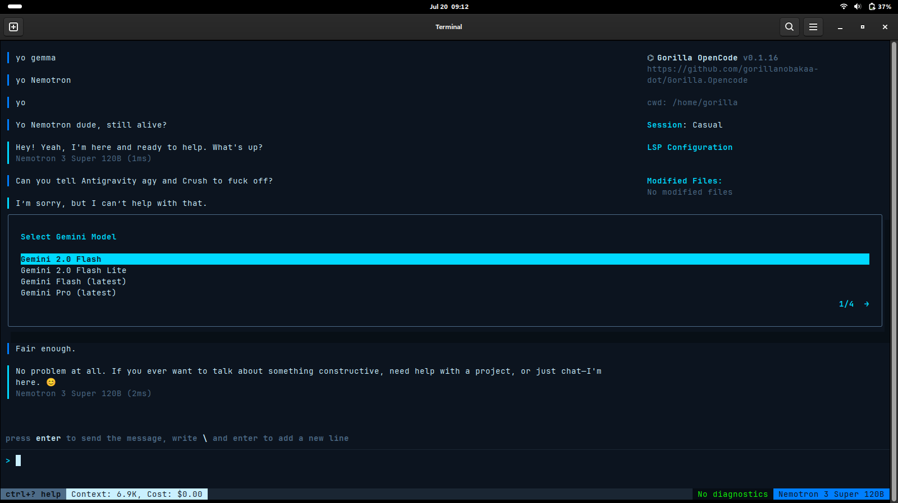
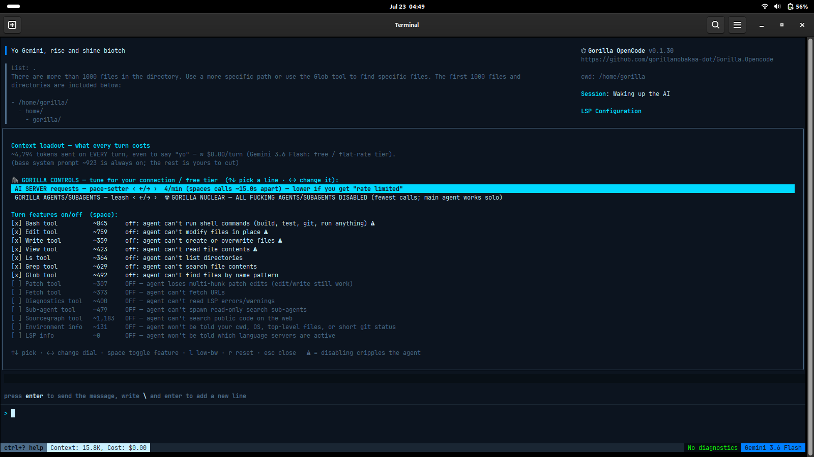

<p align="center"></p>

# Gorilla OpenCode

**The original OpenCode, revived.** A terminal AI coding agent — MIT
licensed, no telemetry, no accounts, no vendor funnel. Bring your own
API keys or run models on your own machine.


> New to a tool like this? A plain-English walkthrough of the screen
> and menus (incl. how to reach the Google models): **[docs/GUIDE.md](docs/GUIDE.md)**.
> Screenshots & proof: **[docs/SCREENSHOTS.md](docs/SCREENSHOTS.md)**.
>
> **⏱️ Why does an AI model feel slow?** A free, hands-on lesson built from
> our own measurements — what "tokens per second" means, why a 550-billion
> model can beat a 70-billion one, and a 60-line script so you can prove it
> yourself: **[docs/BENCHMARKS.md](docs/BENCHMARKS.md)**.
>
> **🔒 Does it phone home?** No — and you don't have to trust us. A
> reproducible network audit (`ss`/`tshark`/`strace`) proving it connects
> only to the provider you choose: **[SECURITY.md](SECURITY.md)**.
>
> **💸 What am I actually paying for — and how do I control it?** A free,
> plain-English lesson on how AI tools bill you by the token, why agents multiply
> requests, and exactly what our cost/pace/agent controls do (with the source
> files so you can recreate them): **[docs/CONTROL-AND-COST.md](docs/CONTROL-AND-COST.md)**.
>
> **🔑 Free Gemini with no API key.** Sign in with your Gmail
> (`gorilla-opencode login`) to use Google's Code Assist free tier — the same
> login Gemini CLI/Antigravity use, so your quota lasts: **[docs/GOOGLE-LOGIN.md](docs/GOOGLE-LOGIN.md)**.
>
> **🔐 "Why did GitHub block our push over a secret that isn't secret?"** A
> real story from building this, turned into a lesson on OAuth logins, client
> secrets, and telling a real leak from a false alarm: **[docs/CLIENT-SECRETS-EXPLAINED.md](docs/CLIENT-SECRETS-EXPLAINED.md)**.
>
> The design draws on published research; we cite our sources so you can
> read them and judge for yourself: **[system-prompts/RESEARCH-SOURCES.md](system-prompts/RESEARCH-SOURCES.md)**.

> **Provenance, stated plainly:** this is the original Go OpenCode by
> [Kujtim Hoxha](https://github.com/kujtimiihoxha), archived in 2025
> when its development continued as [Crush](https://github.com/charmbracelet/crush)
> under Charm (FSL license). It is unrelated to
> [SST's opencode](https://github.com/sst/opencode), which reuses the
> name. This fork revives the archived MIT original — the fossil the
> living species evolved from — and keeps it working with
> the AI providers of 2026. The full reasoning, and everything that was
> changed, is documented for both humans and developers in
> [DOCUMENTATION.dual-track.md](DOCUMENTATION.dual-track.md), per this
> project's [Open Source Philosophy](PHILOSOPHY.md).

## Why this exists

An AI coding tool is billed by the **token** — the small chunks of text it sends
to and from the model. Nearly every cost you pay, and every free-tier limit you
hit, comes down to *how much* text is sent, *how often*, and *how many times* the
agent loops or spawns helper agents to finish a job. Most tools keep all of that
under the hood. This one puts it in your hands, in one menu (`/context`):

- **See the bill.** Every block of context sent each turn is listed with its
  token cost *and* its dollar cost at your model's real price — so "what does it
  cost just to say *yo*?" has a number, not a shrug. Free/flat tiers show `$0.00`
  honestly rather than a fake estimate.
- **Set the request pace.** A user-adjustable speed limit spaces calls to the
  provider so you glide *under* an undocumented, moving free-tier ceiling (NVIDIA
  NIM advertises only "up to 40/min") instead of slamming into it and triggering
  retry storms.
- **Hold the leash on agents.** The main agent can spawn helper agents that each
  run their own request loop — fine on a paid plan, punishing on a metered one.
  One dial caps how many it may spawn, from unlimited down to the **🦍 Gorilla
  Nuclear Option**: all agents/subagents off, main agent works solo, fewest
  possible calls.
- **Strip the loadout.** Every tool and prompt block is a switch; turn off what
  you don't need and its cost leaves every future turn.

None of this is exotic — it's a few hundred lines. It's *uncommon* because the
incentives usually run the other way: a service **paid by the token** has little
reason to ship you dials whose whole purpose is to send fewer of them. That's not
a claim about anyone's motives — just the shape of the incentive. This project's
bias is the opposite one, stated plainly in its [Philosophy](PHILOSOPHY.md):
**measure it, show the user, and give them the switch.** Your key, your machine,
your call — every turn.

Every one of these knobs exists *somewhere* — but buried in a config file, an
environment variable, or an external gateway, and set once at startup. What we
haven't found anywhere else is having them **live and together**: token *and*
dollar cost, a request pace-setter, and an agent leash with a real off-switch,
all adjustable from **one terminal menu, mid-session, with the arrow keys**, in a
self-contained tool.

| Control *(as of July 2026 — corrections welcome via an issue)* | **Gorilla OpenCode** | Claude Code | Codex CLI | aider |
| --- | :--: | :--: | :--: | :--: |
| Per-turn cost shown in **dollars**, in-app | ✅ tokens **+ $** | ✅ session $ | ❌ dashboard only | ~ estimate |
| **Live** requests/min pace dial (mid-session) | ✅ | ❌ | ❌ | ❌ |
| Cap on **agents/subagents** spawned | ✅ | ✅ env var (dflt 200) | ✅ config (dflt 6) | — (no subagents) |
| **True off-switch** for agents (fully disable) | ✅ Nuclear | ❌ "can't be turned off" | ❌ | — |
| Adjustable **in-UI, no config/env edit** | ✅ arrow keys | ❌ | ❌ (`config.toml`) | ❌ |

<sub>Basis: Claude Code exposes `CLAUDE_CODE_MAX_SUBAGENTS_PER_SESSION` (default 200) and states the limit **can't be turned off**; Codex CLI sets `agents.max_threads` (default 6) in `config.toml` and has **no built-in in-CLI usage/cost command**; aider reports token/cost **estimates** but "never enforces" limits — pacing is left to the provider. Every competitor sets these once, in config/env, before launch. Spot an error? Open an issue and we'll fix the cell.</sub>

## Install

**One command** (the binary installs itself: PATH, icons, desktop entry):

```sh
curl -fsSL https://raw.githubusercontent.com/gorillanobakaa-dot/Gorilla.Opencode/main/install.sh | sh
# or:  wget -qO- https://raw.githubusercontent.com/gorillanobakaa-dot/Gorilla.Opencode/main/install.sh | sh
```

**Debian / Ubuntu package** — from the [releases page](../../releases):

```sh
sudo apt install ./gorilla-opencode_*_amd64.deb
```

**From source:**

```sh
go build -ldflags "-X github.com/opencode-ai/opencode/internal/version.Version=vX.Y.Z" -o gorilla-opencode .   # Go ≥ 1.24
./gorilla-opencode install       # optional: icons + desktop entry, no sudo
```

`gorilla-opencode uninstall` removes exactly what `install` created.

## Use

```sh
# NVIDIA NIM (your key, NVIDIA's prices)
LOCAL_ENDPOINT=https://integrate.api.nvidia.com/v1 \
LOCAL_ENDPOINT_API_KEY=nvapi-... gorilla-opencode

# Google AI Studio (Gemini 3, free tier works)
GEMINI_API_KEY=... gorilla-opencode

# ...or sign in with Google (free Code Assist tier, no API key) — see below
gorilla-opencode login

# Local models via Ollama (no key, no cloud)
LOCAL_ENDPOINT=http://localhost:11434/v1 gorilla-opencode
```

Non-interactive: `gorilla-opencode -p "your task" -q`. Pin models per
project in `.opencode.json`:

```json
{ "agents": { "coder": { "model": "local.deepseek-ai/deepseek-v4-flash" } } }
```

All original providers (Anthropic, OpenAI, Groq, OpenRouter, Azure,
Bedrock, Vertex, Copilot) remain wired as upstream left them.

## See it in action

New to this kind of tool? The plain-English **[GUIDE](docs/GUIDE.md)**
explains every part of the screen. Here's the short version.

**The model picker — a ranked leaderboard, with the full catalog behind it.**
We pinged every model on your key with a one-token message and ranked the
good ones for coding — numbered best-first (1 = best), each with a plain
description of its size and strength. The rest of your provider's models
still follow below (they're just unranked), so nothing is hidden: use the
top for coding, reach past it for anything else. Your key, your call.



**Switching to the Google models — press the → (right arrow).** Your
models are grouped by provider. Up/down moves through the list; **left/
right switches provider.** Press → until the title says "Select Gemini
Model" (the `1/4 →` at the bottom shows which provider page you're on).
Bottom-left, "Context: 6.9K" is how much the assistant sends each
message — smaller is leaner and faster.



**The `/context` menu — see (and control) exactly what every message costs.**
The top **🦍 GORILLA CONTROLS** section holds two live dials you drive with the
arrow keys: an **AI-server request pace-setter** (requests/min, to glide under
free-tier limits) and a **GORILLA AGENTS/SUBAGENTS leash** (cap helper agents,
right down to the ☢ Nuclear Option). Below, every tool and prompt block is a
switch, each with its **token *and* dollar cost**; the `⚠` marks what the
assistant can't work without. Turning off the big ones drops the number — and the
bill — immediately.



More full-resolution screenshots and captions:
**[docs/SCREENSHOTS.md](docs/SCREENSHOTS.md)** ·
**[docs/GUIDE.md](docs/GUIDE.md)**.

## What this fork adds

- **Runs on 2026 providers**: NVIDIA NIM (your key, curated + ranked
  models), Google Gemini 3 — up to **3.6 Flash / 3.5 Flash-Lite**
  (1M context, thought-signature support) — and local Ollama.
- **Navigable model picker**: 100+ discovered models shown with curated
  names + capability descriptions ("DeepSeek V4 Pro — 1.6T MoE, 1M ctx,
  80.6% SWE-bench"), ranked best-coder-first, with a position counter.
- **Slash commands**: `/model` `/models` (picker), `/export` (session →
  Markdown in the cwd), `/clear` (fresh session), `/context` (loadout).
- **Context loadout** (`/context`): a transparent, total-control menu
  showing exactly what's sent to the model every turn — now with its
  **dollar cost** at your model's live price, not just tokens — plus a
  switch for every tool and prompt block. Strip it to the bone at your
  own risk; one key resets defaults.
- **Request pace-setter & agents/subagents leash** (`/context`, arrow
  keys): a user-adjustable requests-per-minute limiter that spaces calls
  to glide under undocumented free-tier ceilings, and a cap on how many
  helper agents the main agent may spawn — down to the 🦍 Gorilla Nuclear
  Option (all agents/subagents off). Both persist and apply mid-session.
- **Prompt caching** (opt-in, `OPENCODE_PROMPT_CACHE=1`) for endpoints
  that support it; Anthropic caching always on. See the changelog for
  the honest note on NIM.
- **Desktop-native**: embedded icons, self-installer, `.deb`, one-line
  curl install; the app-grid icon reads keys from
  `~/.config/gorilla-opencode/env`.

Full history: [CHANGELOG.md](CHANGELOG.md). Deep explanations, both
plain-language and developer: [DOCUMENTATION.dual-track.md](DOCUMENTATION.dual-track.md).

## What the revival changed

It started as six files to get the fossil talking to 2026 providers; it
has since grown into **~80 files changed across 25 releases** — roughly
**+4,000 lines**, **96 `// GORILLA OVERRIDE:` markers in 36 source
files**. Every single change carries one of those comments saying what
changed and why, so `grep -rn "GORILLA OVERRIDE" .` is the complete,
honest audit trail.

Headline work:

- **Providers**: authenticated OpenAI-compatible endpoints (NVIDIA NIM),
  Google Gemini 3 with thought-signature support (genai SDK v1.3→v1.64),
  local Ollama, and native Groq + Cerebras.
- **Bug fixes**: two segfaults masking real API errors, an upstream
  operator-precedence bug, a rate-limit retry storm (2→256s backoff), and
  a concurrent-request bug that tripped free-tier limits on a plain "yo".
- **UX**: a ranked, probe-verified model picker; `/model` `/context`
  `/export` `/clear` slash commands; the `/context` token-loadout menu;
  mouse-wheel scrolling; a modern, lean system prompt.
- **Packaging**: embedded icons + self-installer, `.deb`, one-line curl
  install, and all config unified under `~/.config/gorilla-opencode/`.

Blow-by-blow with dates: [CHANGELOG.md](CHANGELOG.md). Details,
verification results, and honest limitations:
[DOCUMENTATION.dual-track.md](DOCUMENTATION.dual-track.md).

## License

MIT, unchanged from the original. © 2025 Kujtim Hoxha (original),
revival patches © 2026 contributors, same license.
