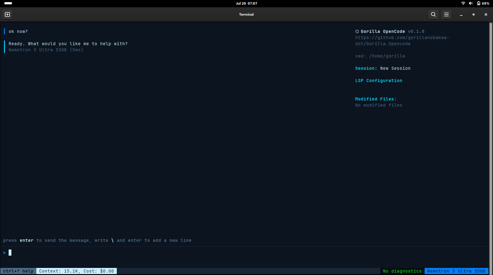

<p align="center"></p>

# Gorilla OpenCode

**The original OpenCode, revived.** A terminal AI coding agent — MIT
licensed, no telemetry, no accounts, no vendor funnel. Bring your own
API keys or run models on your own machine.



> Proof gallery — running on NVIDIA NIM and the `/context` token-loadout
> menu in action: **[docs/SCREENSHOTS.md](docs/SCREENSHOTS.md)**.
>
> The design draws on published research; we cite our sources so you can
> read them and judge for yourself: **[system-prompts/RESEARCH-SOURCES.md](system-prompts/RESEARCH-SOURCES.md)**.

> **Provenance, stated plainly:** this is the original Go OpenCode by
> [Kujtim Hoxha](https://github.com/kujtimiihoxha), archived in 2025
> when its development continued as [Crush](https://github.com/charmbracelet/crush)
> under Charm (FSL license). It is unrelated to
> [SST's opencode](https://github.com/sst/opencode), which reuses the
> name. This fork revives the archived MIT original — the fossil the
> living species evolved from — and keeps it working with
> the AI providers of 2026. The full reasoning, and everything that was
> changed, is documented for both humans and developers in
> [DOCUMENTATION.dual-track.md](DOCUMENTATION.dual-track.md), per this
> project's [Open Source Philosophy](PHILOSOPHY.md).

## Install

**One command** (the binary installs itself: PATH, icons, desktop entry):

```sh
curl -fsSL https://raw.githubusercontent.com/gorillanobakaa-dot/Gorilla.Opencode/main/install.sh | sh
# or:  wget -qO- https://raw.githubusercontent.com/gorillanobakaa-dot/Gorilla.Opencode/main/install.sh | sh
```

**Debian / Ubuntu package** — from the [releases page](../../releases):

```sh
sudo apt install ./gorilla-opencode_*_amd64.deb
```

**From source:**

```sh
go build -ldflags "-X github.com/opencode-ai/opencode/internal/version.Version=vX.Y.Z" -o gorilla-opencode .   # Go ≥ 1.24
./gorilla-opencode install       # optional: icons + desktop entry, no sudo
```

`gorilla-opencode uninstall` removes exactly what `install` created.

## Use

```sh
# NVIDIA NIM (your key, NVIDIA's prices)
LOCAL_ENDPOINT=https://integrate.api.nvidia.com/v1 \
LOCAL_ENDPOINT_API_KEY=nvapi-... gorilla-opencode

# Google AI Studio (Gemini 3, free tier works)
GEMINI_API_KEY=... gorilla-opencode

# Local models via Ollama (no key, no cloud)
LOCAL_ENDPOINT=http://localhost:11434/v1 gorilla-opencode
```

Non-interactive: `gorilla-opencode -p "your task" -q`. Pin models per
project in `.opencode.json`:

```json
{ "agents": { "coder": { "model": "local.deepseek-ai/deepseek-v4-flash" } } }
```

All original providers (Anthropic, OpenAI, Groq, OpenRouter, Azure,
Bedrock, Vertex, Copilot) remain wired as upstream left them.

## What this fork adds

- **Runs on 2026 providers**: NVIDIA NIM (your key, curated + ranked
  models), Google Gemini 3 (thought-signature support), local Ollama.
- **Navigable model picker**: 100+ discovered models shown with curated
  names + capability descriptions ("DeepSeek V4 Pro — 1.6T MoE, 1M ctx,
  80.6% SWE-bench"), ranked best-coder-first, with a position counter.
- **Slash commands**: `/model` `/models` (picker), `/export` (session →
  Markdown in the cwd), `/clear` (fresh session), `/context` (loadout).
- **Context loadout** (`/context`): a transparent, total-control menu
  showing exactly what's sent to the model every turn and its token
  cost, with a switch for every tool and prompt block — strip it to the
  bone at your own risk, one key resets defaults.
- **Prompt caching** (opt-in, `OPENCODE_PROMPT_CACHE=1`) for endpoints
  that support it; Anthropic caching always on. See the changelog for
  the honest note on NIM.
- **Desktop-native**: embedded icons, self-installer, `.deb`, one-line
  curl install; the app-grid icon reads keys from
  `~/.config/gorilla-opencode/env`.

Full history: [CHANGELOG.md](CHANGELOG.md). Deep explanations, both
plain-language and developer: [DOCUMENTATION.dual-track.md](DOCUMENTATION.dual-track.md).

## What the revival changed

Six files. Every change carries a `// GORILLA OVERRIDE:` comment saying
what and why — `grep -rn "GORILLA OVERRIDE" .` is the complete audit
trail. Headlines: authenticated OpenAI-compatible endpoints (NVIDIA NIM),
Gemini 3 thought-signature support (SDK v1.3→v1.64), two segfault fixes
that were masking real API errors, one upstream operator-precedence bug,
embedded icons + self-installer. Details, verification results, and
honest limitations: [DOCUMENTATION.dual-track.md](DOCUMENTATION.dual-track.md).

## License

MIT, unchanged from the original. © 2025 Kujtim Hoxha (original),
revival patches © 2026 contributors, same license.
