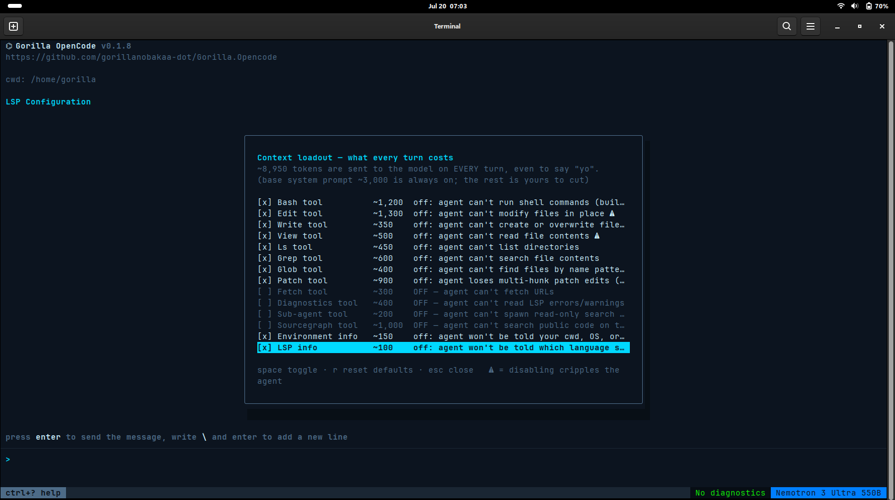

# Gorilla OpenCode — Proof it works

Real screenshots from a Debian 13 / GNOME 48 machine, running the
revived original OpenCode on an NVIDIA NIM API key. These are the
receipts for what the [CHANGELOG](../CHANGELOG.md) describes.

## Running on NVIDIA NIM

The revived agent, rebranded, pointed at NVIDIA NIM with the user's own
key — no Charm gateway, no telemetry, no account.

## The context loadout (`/context`)

Total transparency about what every turn costs. The menu names each
piece of per-turn context, its token cost, and what you give up by
turning it off. `⚠` marks components whose removal cripples the agent.

## Loadout after switching things off

The same menu after disabling Fetch, Diagnostics, Sub-agent and
Sourcegraph — the per-turn total drops, and disabled rows dim. This is
the "opt out of everything" philosophy in action: your tokens, your
call, one key (`r`) to restore defaults.

---

*These were captured on v0.1.8. From v0.1.9 the loadout menu is wider
(no truncated tradeoffs) and its token figures are measured from the
real tool schemas and system prompt rather than estimated — see the
changelog.*
