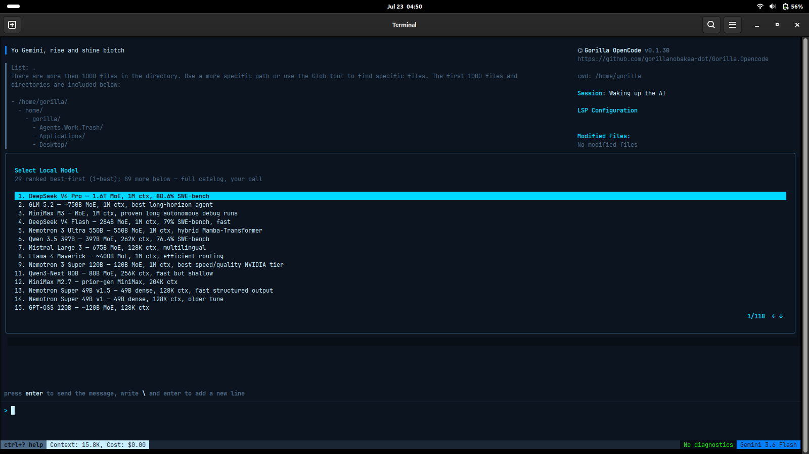
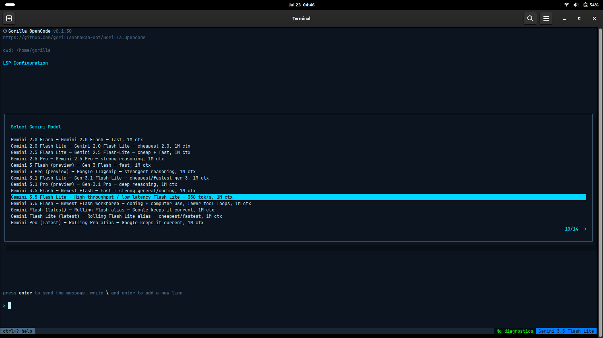
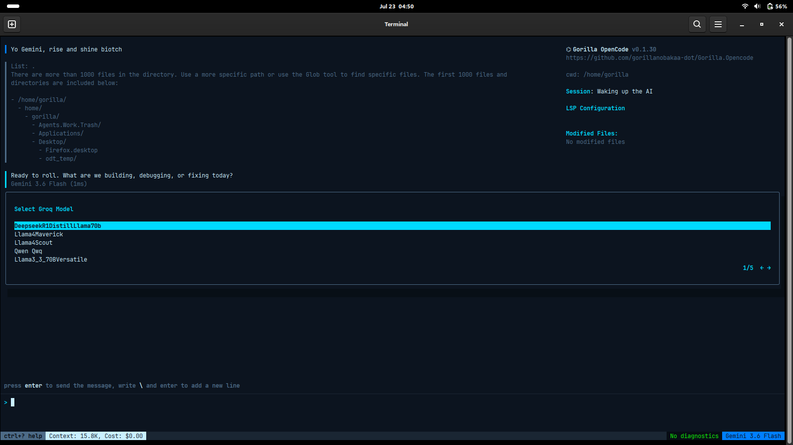
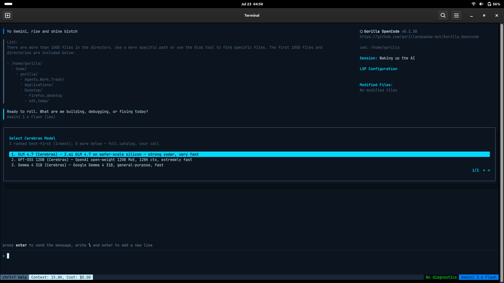

# Gorilla OpenCode — screenshots & proof

Real screenshots from a Debian 13 / GNOME 48 machine running the revived
OpenCode on an NVIDIA NIM key. **New here? Read the plain-English
[GUIDE.md](GUIDE.md)** — it explains every part of the screen, the
menus, and the not-obvious ← → arrow trick to switch to the Google
models.

All screenshots are full-resolution (1600×899) so the terminal text is
readable — the complete set is in [`screenshots/gallery/`](screenshots/gallery/).

## The model picker, full width (v0.1.16)

118 models, each with a capability description, sorted best-for-coding
first, with a position counter. Up/down moves through models; **left/
right switches provider**.

## Reaching the Google (Gemini) models — press the → arrow

Your models are grouped by provider. Press **→** in the picker to page
from NVIDIA to **"Select Gemini Model"** — the `1/4 →` at the bottom
shows you're on the Gemini page. Bottom-left shows the context down to
**6.9K** (it used to be ~15K).

## One tool, every provider — the latest models (v0.1.30)

The same terminal, the same key-per-provider setup, reaching four different
backends. Each picker is ranked best-for-coding first, with plain capability
notes, and you page between providers with the **← →** arrows.

**NVIDIA NIM** — the full ranked catalog (DeepSeek V4 Pro #1, GLM 5.2, MiniMax M3,
Nemotron…), 118 models deep, best-coder-first with a position counter.

**Google Gemini** — the current lineup, Gemini 2.0 through **3.6 Flash** (1M
context, the newest workhorse), plus the rolling `latest` aliases.

**Groq** — DeepSeek-R1-Distill-Llama-70B, Llama 4 Maverick / Scout, Qwen QwQ,
Llama 3.3 70B, at Groq's signature speed.

**Cerebras** — GLM 4.7 on wafer-scale silicon, GPT-OSS 120B, Gemma 4 31B —
"extremely fast" inference.

## The context loadout & Gorilla controls — every token (and dollar) accounted for

`/context` shows exactly what's sent to the model every turn — with its **token
*and* dollar cost** — and lets you switch any of it off. The top **🦍 GORILLA
CONTROLS** section adds two arrow-key dials: an **AI-server request pace-setter**
(requests/min, to stay under free-tier limits) and a **GORILLA AGENTS/SUBAGENTS
leash** (cap helper agents down to the ☢ Nuclear Option). Full write-up:
[CONTROL-AND-COST.md](CONTROL-AND-COST.md); how-to in the
[GUIDE](GUIDE.md#the-context-loadout-context--your-token-budget).

---

*The design draws on published research — sources cited in
[system-prompts/RESEARCH-SOURCES.md](../system-prompts/RESEARCH-SOURCES.md).*
