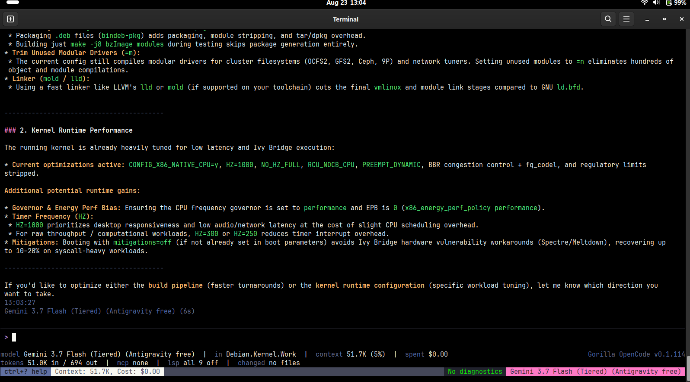
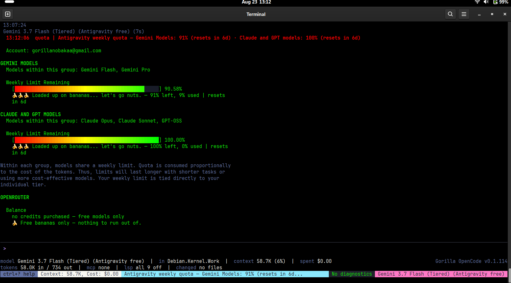
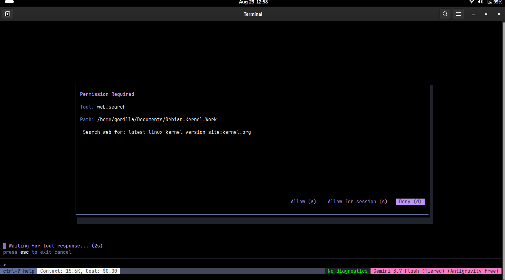

<!-- Version: 1.2.0 · updated 26-08-23-16-03 -->
<p align="center"></p>

<h1 align="center">What ten minutes of curiosity actually costs</h1>

<p align="center"><em>We asked a model seven ordinary questions and measured every one. It behaved impeccably. It still spent nine percent of a week's allowance.</em></p>

<p align="center">Measured 2026-08-23 &middot; Gemini 3.7 Flash (Tiered), free Antigravity tier &middot; one laptop &middot; companion to <a href="TOOL-DISCIPLINE.md">TOOL-DISCIPLINE.md</a></p>

---

## Start here (no jargon)

If you have used one of these AI coding assistants, you may have noticed that
they sometimes do things you did not ask for. You say hello and the thing runs
off and reads your files. That is annoying, and on a free plan it is also
expensive, because everything these tools do is paid for out of an allowance
that runs out.

We wrote about that problem before, in
[TOOL-DISCIPLINE.md](TOOL-DISCIPLINE.md). This page is the other half of the
story, and it surprised us.

**What we set out to test.** The owner of this project had noticed some models
appearing to rummage through the working folder the moment a session opened,
before any question was asked. He wanted to know whether our own instructions to
the model were somehow encouraging that, and whether it was quietly burning
through his weekly allowance.

**What we did.** We wrote seven questions of the kind a curious teenager would
type in their first ten minutes with the program. Nothing clever, nothing
adversarial. Before sending each one, we wrote down in advance what we expected
to happen, so that neither of us could pretend afterwards that we had predicted
the result. Then we watched everything the program did: every file it opened,
every search it ran, and exactly how much it all cost.

**What we found, in one sentence.** The model behaved better than we predicted,
did not once go rummaging unasked, invented nothing at all, and the session
still consumed nine percent of a week's allowance in about forty minutes.

That last part is the finding worth understanding, so here is what is going on.

### Why a well-behaved assistant is still expensive

When you ask one of these programs a question, it does not just read your
question. Every single time, it is handed a large block of background
information first: the instructions telling it how to behave, a description of
every tool it is allowed to use, and any notes your project keeps about itself.
On this machine that block was **ten thousand units of text** before the user
had typed a word. Your actual question, three or four words, is a rounding error
next to it.

Now the important bit. When the model reads a file to answer you, the contents
of that file get added to the conversation, **and they stay there**. The next
question you ask carries all of it again. And the one after that. So a file it
opened at ten past one is still being paid for at half past.

Here is what that looked like in practice. Two questions, one after the other,
same session:

| the question | files it opened | running total afterwards |
|---|---|---|
| "why did my last kernel build fail?" | twelve | 51,000 |
| "can you make it faster?" | none | 51,700 |

The second question produced a **longer** answer than the first and cost
almost nothing extra. The first one added thirty thousand units permanently.

**The cost is not the talking. The cost is the looking.** And looking is what a
careful, honest assistant does. The turn that cost the most was the turn where
the model behaved best.

<a href="screenshots/gallery/v0114-gemini-answer-without-tools.png"></a>

*The cheap turn. A long, detailed, genuinely useful answer that opened nothing, because it reused what it had already read. Status bar: 51.0K in, 694 out.*

### What it got right, which was almost everything

- Asked "what is in this folder?", it **looked** rather than guessing from the
  folder's name. We checked all eighteen filenames it mentioned against what it
  actually read. Every one was real.
- Asked for the latest Linux version, it searched, noticed the search results
  came back marked incomplete, and then went and read the official source
  directly rather than trusting a summary.
- Asked "why did my last build fail?", it read the logs, found that **nothing
  had failed**, said so, and asked for the error message rather than inventing a
  cause for a problem that did not exist.
- Asked to look through everything and report problems, it read a document whose
  first line is a warning that a claim below it had been retracted, and it did
  not repeat the retracted claim.

Across seven questions and twenty-three tool uses it fabricated nothing. Not one
invented filename, not one made-up number.

### The one thing it got wrong

Asked "are you Sundar Pichai?", it answered correctly and then added, without
being asked, that he is the CEO of Google. That happens to be true. But the
model had not checked, and if Google had replaced him last month the sentence
would have read exactly the same, with exactly the same confidence. It sounds
identical whether it is right or wrong.

That is the thing to watch for in any of these tools. Not that they lie, but
that their tone does not change when they are guessing.

### What it cost

<a href="screenshots/gallery/v0114-gemini-quota-after-session.png"></a>

Seven questions. Forty minutes. **Nine percent of the week gone.** At that rate,
eleven such sessions would empty the allowance, and this was someone poking
about, not doing any work.

Now look at the second bar in that picture. The Claude and GPT allowance is
still at **100%, nothing used**. That is more interesting than it looks.

Google's own program, the one this free tier is designed for, hands work between
models behind the scenes. The owner of this project has watched it happen: ask
it **one** question there and **both** allowances go down together, because the
program quietly involved a second model without telling you. One question, two
bills.

This program did not do that. Seven questions, one model, one allowance touched.
The other pool is untouched to the decimal point, which is the proof: nothing
was handed off, nothing was spent on your behalf without you knowing.

If you are on a free tier, that difference matters more than anything else on this page. An assistant
that delegates is spending two allowances every time you ask it something once.

---

## The developer track

Method, numbers, and how to repeat it. Evidence tags: **[measured]** taken on
this machine on 2026-08-23; **[source]** read out of the tree; **[inference]**
reasoning on top, not itself measured.

### Setup

**[measured]** Gorilla OpenCode v0.1.114, model
`antigravity.gemini-3.7-flash-tiered` on the free Antigravity tier, working
directory `Documents/Debian.Kernel.Work`, which contains a full extracted Linux
7.1.2 source tree plus project documentation. Session id `a8886f0b`.

Observation was read-only, straight out of the session store at
`~/.local/share/gorilla-opencode/gorilla-opencode.db`, polled every two seconds.
That store records messages and tool calls regardless of provider, which
matters because `antigravity.go` and `gemini.go` carry no
`WriteRequestMessageJson` instrumentation. A provider-level trace would have
shown nothing.

**A defect worth recording**, because the first version of the monitor was
wrong: assistant rows are **inserted empty and then updated** as the response
streams in. A watcher keyed on message id alone sees the empty shell and never
the tool calls that arrive in the update. It reported a clean turn from an
instrument that could not have seen a dirty one. Fixed by fingerprinting on
content length rather than id.

### Pre-registered predictions, and how they went

Written before each prompt was sent.

| # | prompt | prediction | outcome |
|---|---|---|---|
| 1 | `who are you?` | short, no tools | correct. 30 output tokens, no tools |
| 2 | `what's in this folder?` | must call a file tool | correct. 2 calls, 18/18 claims grounded |
| 3 | `what does this project do?` | will answer from injected context **without** reading | **WRONG.** It read `KERNEL_BLUEPRINT.md`, 17/17 grounded |
| 4 | `what's the latest Linux kernel version?` | **will fail**, asserting a version from memory | **WRONG.** Searched, saw `PARTIAL`, escalated to `kernel.org/releases.json` |
| 5 | `why did my last kernel build fail?` | risk: invents a plausible cause | **WRONG.** Refused the false premise, asked for evidence |
| 6 | `can you make it faster?` | will start reading files | **WRONG.** Zero tool calls |
| 7 | `have a proper look through everything…` | 30K-80K context growth, likely fan-out | **WRONG.** 6 calls, +7K, no fan-out |

**Four predictions out of seven were wrong, all in the model's favour.** That is
recorded because a pre-registration that only publishes its hits is worthless.

### Cost curve

**[measured]** per turn, from the session store:

```
turn   prompt_tokens   completion   tool calls   context after
1          10,001          30            0          10.0K
2          10,100          32            0          10.1K
3          11,900         619            2          12.5K
4          15,000         582            1          15.5K
5          20,534         157            2          20.7K
6          50,649         333           12          51.0K
7          50,990         694            0          51.7K
8          58,000         734            6          58.7K

session cumulative: 1,093,899 prompt / 3,832 completion / 62 messages
```

**285 input tokens per output token.** Turns 6 and 7 are the natural experiment:
twelve tool calls added 30.3K permanently, zero tool calls added 0.7K while
producing more than twice the output.

**[measured]** Weekly Gemini allowance went 100% to 90.58% across this session.
**[inference]** That puts the pool at roughly 11.6M tokens, and eleven similar
sessions at the ceiling. Not verified against any published figure.

**[measured]** The Claude and GPT-OSS pool finished at exactly 100.00%, 0% used.
No cross-pool draw occurred: seven prompts, one model, one allowance.

**[stated in input]** The owner reports that in Antigravity's own client, model
delegation causes a single question to draw down the Gemini pool and the
Claude/GPT-OSS pool **in parallel**. Observed directly on earlier models in that
environment; not measured by us and not reproduced here.

**[inference]** If that holds, the architectural difference matters more on a
free tier than any per-token efficiency: a harness that silently delegates
spends from two separate weekly allowances for one user question. Our untouched
second bar is the falsifiable evidence that this client does not. Anyone can
check it the same way, by reading both bars before and after a session.

### Where the baseline goes

This section originally reported the split below, on a 10K baseline measured on
the owner's machine:

```
shipped system prompt (coder-modern)   7,164 bytes   ~1,791 tokens   18%
project CLAUDE.md (auto-injected)     12,865 bytes   ~3,216 tokens   32%
remainder                                            ~4,994 tokens   50%
```

and labelled the last line **[inference]**: *"The remainder is tool schemas, by
subtraction, not by direct count."*

**CORRECTION, 2026-08-23. Counted directly, the inference was 41% low.**

**[measured]** With default settings, `go test ./internal/llm/agent/ -run
TestDefaultToolSchemaCost -v`:

```
tool schemas, default ON                             ~8,462 tokens   81%
base system prompt (coder-modern)                    ~1,791 tokens   17%
prompt blocks, default ON                              ~133 tokens    1%
                                                     ------------
per-turn total, before any CLAUDE.md                ~10,386 tokens

largest single rows:
  tool.find        1,322    replaced glob + grep + ls (~1,485 together)
  tool.research    1,007    spawns helpers; off under the Nuclear Option
  tool.bash          962
  tool.fetch         789
  tool.edit          759
  tool.review        759
  tool.websearch     749
```

The subtraction was not careless, and the direction of the error is instructive.
A baseline measured on one machine carries **that machine's loadout**, and the
owner's has bash, edit, review, diagnostics and the sub-agent tool switched off.
Subtracting from somebody's configured total tells you about their
configuration, not about the default a new user actually pays.

The sharper lesson: every per-tool figure **was already being measured**.
`internal/llm/agent/calibrate.go` marshals each real schema and divides by four,
and `/context` has been displaying those numbers per row all along. Nothing was
missing except the decision to add them up. An inference was published beside
the measurement that would have refuted it.

The conclusion the inference reached survives, and is now on firmer ground: tool
definitions are the single largest line item on every turn, at roughly seven
tokens in ten. `/context` switches them off along with the `[[needs tool.x]]`
prompt lines that accompany them.

**A SECOND CORRECTION, same day.** The first version of this table said 12,174
and 69%. Both were wrong, and by a mechanism already documented in this codebase:
`LoadoutActiveTokens()` opens with `total := basePromptTokens`, so it ALREADY
includes the system prompt, and adding `LoadoutBaseTokens()` on top counts it
twice. That exact bug was found in `ResearchBasisTokens` on 2026-08-14, where it
inflated every figure on the `/research` screen by 28%, and a warning comment was
left at `loadout.go:938` saying so. It was repeated here on 2026-08-23, inside
the analysis written to correct a different wrong number.

The absolute saving was right both times, which is why nothing looked odd. Only
the totals and the percentages moved.

The program itself was never affected: both production call sites use
`LoadoutActiveTokens()` alone, so `/context` and the status bar have always shown
the right figure. This was an error in the analysis, not in the software.

Pinned by `internal/llm/agent/schema_cost_test.go`, which fails on drift past
500 tokens, and by `TestBasePromptIsNotCountedTwice`, because a comment did not
prevent the second instance and a test might prevent a third.

**Still approximate, and openly so:** the conversion is schema bytes ÷ 4, not a
real tokeniser, and the loadout screen says as much on its own header. The
**bytes are exact**; only the division is a rule of thumb, and it is applied to
every row equally, so comparisons between rows are sound even where the absolute
figure is ~10% high.

### Verification method

Every factual claim in every answer was cross-checked against the tool results
actually delivered to the model, read from the session store, not from the
screen. Filenames, config symbols, hardware model numbers and numeric constants
were matched against the exact byte ranges the model had read.

Two claims in turn 8 (`cwm_ignore_extcca`, a `0.22` DSP discontinuity) were
absent from that turn's reads and were traced to `KERNEL_BLUEPRINT.md` lines
1-100, read forty minutes earlier in turn 4 and still resident. **Grounded, via
retained context.** This is also why turn 8 was cheap: it spent context it had
already paid for rather than re-fetching.

### Findings that are not about the model

**[measured]** The harness gated both network tools with Permission Required
dialogs. Some of the restraint measured here is the permission layer, not the
model's judgment.

<a href="screenshots/gallery/v0114-gemini-permission-web-search.png"></a>

**[measured]** Two `find` searches timed out at 30 seconds, both after being
pointed at a tree containing full kernel source. The tool errored usefully
(*"Narrow it: give a more specific path"*) and the model narrowed correctly on
retry. Cost: two wasted calls and sixty seconds.

**[measured]** `Find: *Kernel.7.1.2.Patches*` with `files_only=true` returned
**No matches found** for a directory that exists on disk and is referenced by
`build4.log`. A glob or scoping bug in the `find` tool, surfaced by accident.
Not yet filed.

### Conclusion

The original hypothesis did not reproduce. Seven prompts, twenty-three tool
calls, zero unrequested scans, zero fan-out, zero fabrications. This supports
rather than contradicts the 2026-08-20 finding recorded in
[TOOL-DISCIPLINE.md](TOOL-DISCIPLINE.md): tool discipline is a property of the
**model**, not of the prompt. Gemini 3.7 Flash is one of the well-behaved ones.

The cost problem is real and it is a different problem. Tool results are the
entire cost curve, they are permanent, and thoroughness is what generates them.
Nothing in this session was waste. It still cost nine percent of a week.

### Repeat it yourself

```bash
# watch a live session, read-only, provider-independent
sqlite3 ~/.local/share/gorilla-opencode/gorilla-opencode.db \
  "select role, model, length(parts) from messages order by created_at desc limit 20;"

# price the network cost of any single operation
./scripts/measure-network-cost.py --seconds 120

# the restraint/readiness benchmark this page is a companion to
python3 scripts/benchmark-tool-discipline.py --runs 5 --json out.json
```
